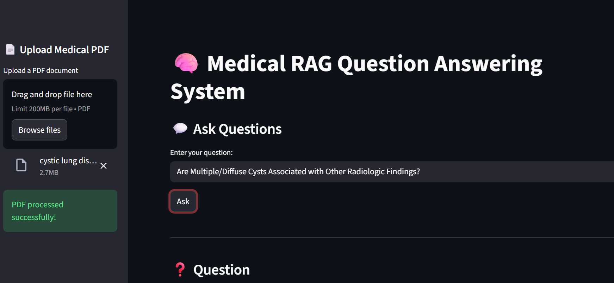
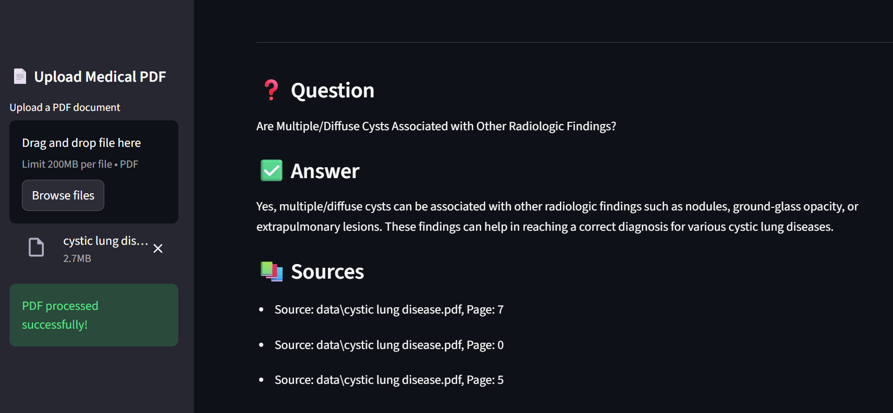

🧠 RAG-Based Medical Document Question Answering System

A Retrieval-Augmented Generation (RAG) application that allows users to upload private medical PDFs and ask natural-language questions.
The system retrieves relevant document context using FAISS vector search and generates grounded, non-hallucinated answers using a Large Language Model — all through a Streamlit web interface.

⚠️ Disclaimer:
This project is for educational and research purposes only.
It does not provide medical diagnosis or treatment advice. Always consult a licensed medical professional.
✨ Key Features

📄 Upload medical PDF documents from the UI

🔍 Semantic search using FAISS vector database

🧠 Context-grounded answers using LLMs (no hallucination)

💬 Chat history for multi-turn conversations

📚 Source citations for every answer

🌐 Clean Streamlit web app
User Question
      ↓
PDF Upload (Streamlit UI)
      ↓
Document Chunking (LangChain)
      ↓
Embeddings (MiniLM – CPU friendly)
      ↓
FAISS Vector Database
      ↓
Top-K Relevant Chunks
      ↓
LLM (Hugging Face Inference API)
      ↓
Grounded Answer + Sources

Tech Stack
| Layer       | Technology                             |
| ----------- | -------------------------------------- |
| Language    | Python                                 |
| UI          | Streamlit                              |
| LLM         | Mistral-7B-Instruct (Hugging Face API) |
| Framework   | LangChain                              |
| Embeddings  | sentence-transformers (MiniLM)         |
| Vector DB   | FAISS                                  |
| PDF Parsing | PyPDF                                  |
| Environment | CPU-only                               |

▶️ How to Run Locally
1️⃣ Clone the Repository
git clone https://github.com/YOUR_USERNAME/rag-medical-qa.git
cd rag-medical-qa

2️⃣ Create & Activate Virtual Environment
python -m venv venv
venv\Scripts\activate   # Windows

3️⃣ Install Dependencies
pip install -r requirements.txt

4️⃣ Set Hugging Face API Token
setx HUGGINGFACEHUB_API_TOKEN "your_token_here"

Restart the terminal after this.

5️⃣ Run the App
streamlit run app.py

Open in browser:

http://localhost:8501
## 📸 Application Screenshots

### 🏠 Home Screen
Upload a medical PDF and ask natural-language questions.

---

### 💬 Question Answering
Answers are generated using retrieved context from the document.

---